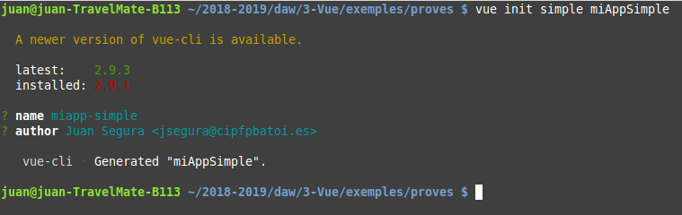
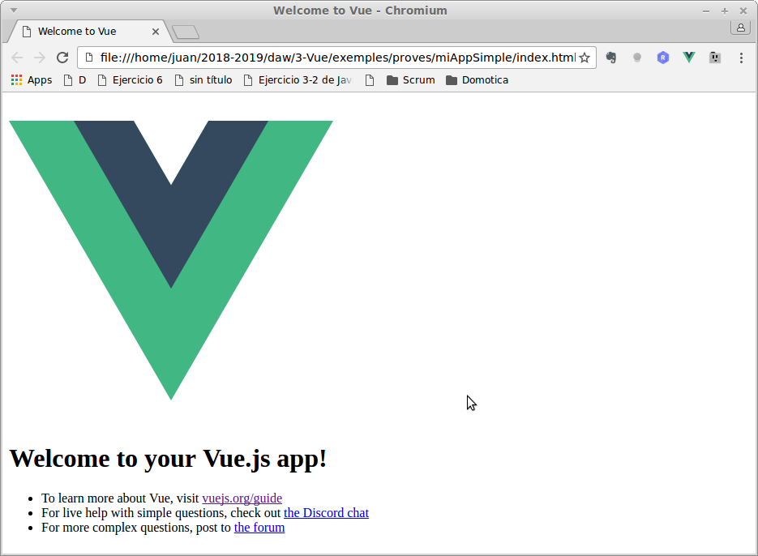
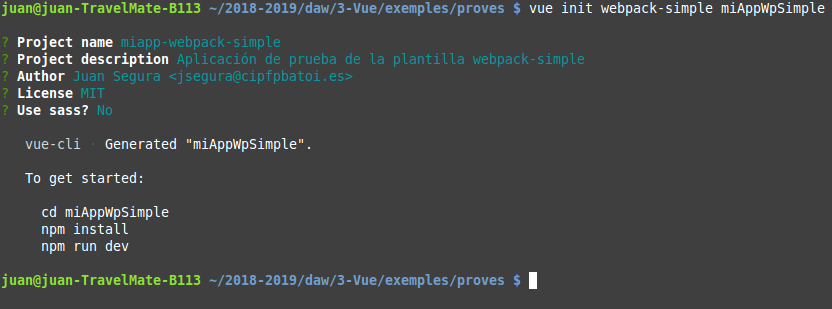
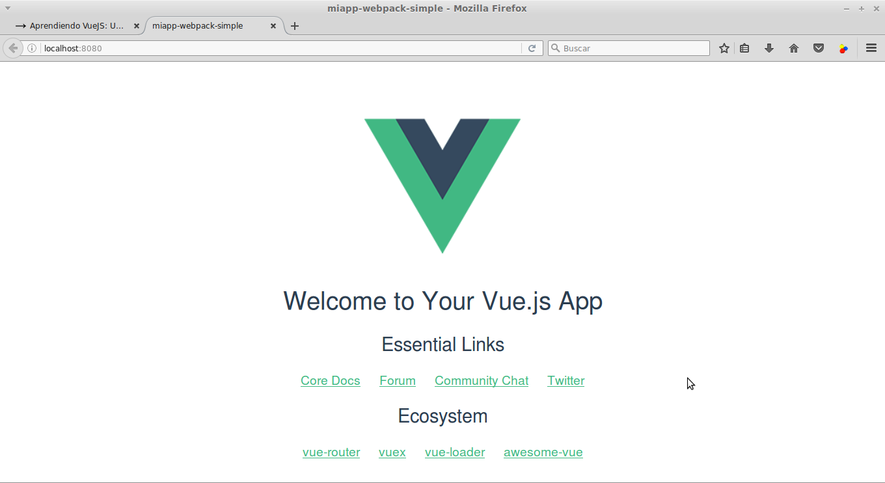
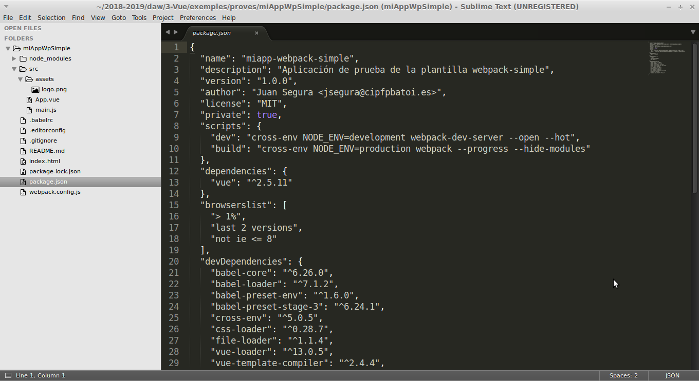
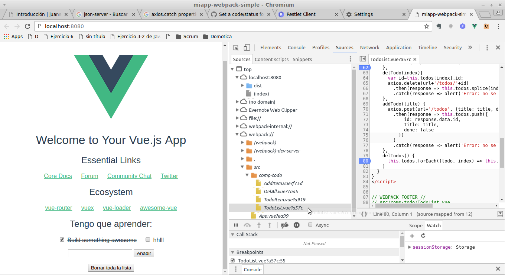
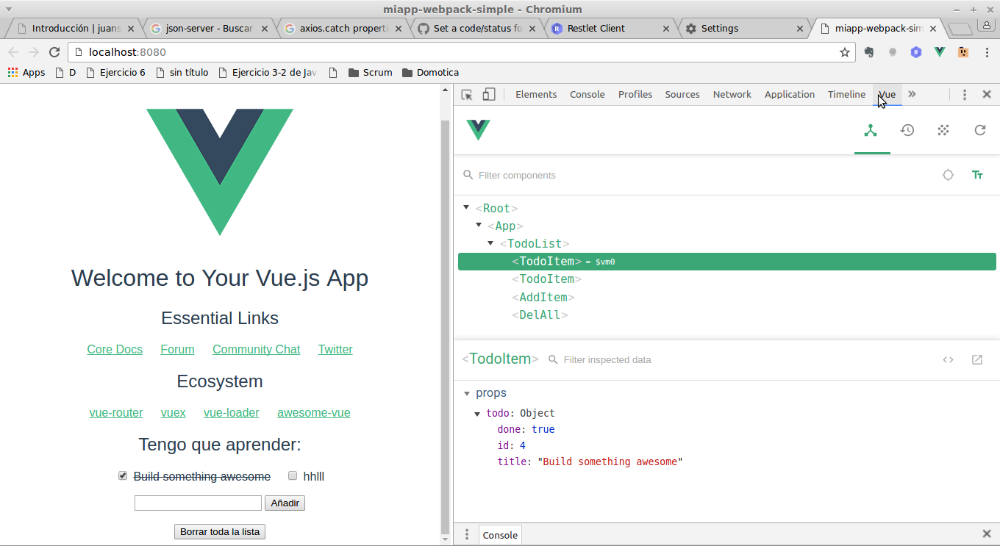

# Vue-cli
Se trata de una herramienta que incluye Vue que nos ayuda en:
* Crea automáticamente el _scaffolding_ básico de nuestro proyecto basándose en una serie de plantillas perdefinidas
* Incluye herramientas como Webpack, Babel, Uglify, ... que permiten
  * gestionar las dependencias de nuestro código
  * empaquetar todos los ficheros _.vue_ y librerías en un único fichero JS y CSS
  * traspilar el código ES2015/2016, SCSS, etc a ES5 y CSS3 estándar
  * minimizar el código generado
* Incluye herramientas que facilitan el desarrollo

## Instalación
Para usar **vue-cli** necesitamos tener instalado **npm** (el gestor de paquetes de Node.js). Si no lo tenemos instalaremos **node.js** de una de las siguientes maneras:
* Si nuestra dsitribución es muy actual podemos instalarlo desde los repositorios como cualquier otro programa (`apt install nodejs`)
* Podemos [descargarlo desde NodeJS.org](https://nodejs.org/es/download/), descomprimir el paquete e instalarlo (`dpkg -i _nombrepaquete_`)
O bien [instalarlo desde _NodeSource](https://nodejs.org/es/download/package-manager/#distribuciones-de-linux-basadas-en-debian-y-ubuntu)_ con
```[bash]
curl -sL https://deb.nodesource.com/setup_10.x | sudo -E bash -
sudo apt-get install -y nodejs
```
(cambiaremos _10.x_ por la versión que queramos)

Una vez instalado **npm** Vue-cli se instala con
```[bash]
npm install vue-cli -g
```
La opción -g es para que lo instale globalmente en el sistema y no instale unca copia para cada proyecto.

Para crear un nuevo proyecto haremos:
```[bash]
vue init _plantilla_ nombre-proyecto
```
Podemos usar, entre otras, las siguientes plantillas:
* simple: el proyecto será un único fichero que contendrá todo el código
* webpack-simple: crea un scaffolding sencillo que incluye webpack
* webpack: incluye también herramientas para testear el proyecto, entre otras
* PWA: para crear una Progressive Web App (App para móviles similar a una app nativa)

## Ejemplo plantilla simple
La crearemos con
```[bash]
vue init simple miAppSimple
```
Esto crea la carpeta _miAppSimple_ y dentro de ella el fichero _index.html_. No hay componentes ni ninguna herramienta extra, simplemente el fichero HTML donde está incluido también el JS.

Además nos hace una serie de preguntas (su nombre y su autor) para configurar nuestro proyecto:


La página generada es:


## Ejemplo webpack-simple
```[bash]
vue init webpack-simple appUsers
```


Una vez creado el proyecto instalaremos sus dependencias entrando dentro de la carpeta y ejecutmos:
```[bash]
npm install
```
Para arrancar el proyecto ejecutamos en la terminal
```[bash]
npm run dev
```
Este script compila el código, muestra si hay errores, lanza un servidor web en el puerto 8080 y carga el proyecto en el navegador (localhost:8080). Si cambiamos cualquier fichero JS de _src_ recompila y recarga la página automáticamente. La página generada es:


Cuando nuestra aplicación esté lista para subir a producción ejecutaremos el script:
```[bash]
npm run build
```

## _Scaffolding_ creado
Se ha creado la carpeta _miAppWpSimple_ y dentro el scaffolding para nuestro proyecto con soporte para Webpack:


Los principales ficheros y directorios creados son:
* package.json: configuración del proyecto (nombre, autor, ...) y dependencias
* webpack.config.js: configuración de webpack
* index.html: html con un div donde se cargará la app y que carga el script build.js
* node_modules: librerías de las dependencias
* src/assets: nuestros CSS, imágenes, etc
* src/main.js: carga componentes y crea la instancia de Vue que 'pinta' el App.vue 
* src/....vue: los diferentes componentes

## package.json
Aquí se configura nuestra aplicación:
* name, description, version, author, license, ...: configuración general de la aplicación
* scripts: ejecutan entornos de configuración para webpack. Por defecto tenemos 2:
  * dev: lanza el servidor web de webpack y configura webpack y vue para el entorno de desarrollo
  * build: crea el fichero **/dist/build.js** con todo el código JS de la aplicación (es el único que vincularemos en index.html)
* dependences: se incluyen las librerías que utiliza nuestra aplicación en producción. Todas las dependencias se instalan dentro de **/node-modules**. Para instalar un nuevo paquete (por ejemplo _axios_ para hacer peticiones Ajax) ejecutamos en la terminal `npm install axios -S` (npm instala el paquete en node-modules y además con la opción -S se añade a las dependencias de package.json
* devDependencies: igual pero son paquetes que sólo se usan en desarrollo (babel, webpack, etc). También se instalan dentro de node-modules pero no estarán en build.js cuando se genere el fichero para producción. Para instalar una nueva dependencia de desarrollo ejecutaremos `npm install _paquete_ -D` (la opción -D la añade a package.json pero como dependencia de desarrollo).

## Estructura de nuestra aplicación
**Fichero index.html:**
```[html]
<!DOCTYPE html>
<html lang="en">
  <head>
    <meta charset="utf-8">
    <title>miapp-webpack-simple</title>
  </head>
  <body>
    <div id="app"></div>
    <script src="/dist/build.js"></script>
  </body>
</html>
```
Simplemente tiene el \<div> _app_ y vincula el script _build.js_.

**Fichero main.js:**
```[javascript]
import Vue from 'vue'
import App from './App.vue'

new Vue({
  el: '#app',
  render: h => h(App)
})
```
Importa la librería _Vue_ y el componente _App.vue_, crea la instancia de Vue y renderiza el componente _App_.

**Fichero App.vue:**
Es el componente principal de la aplicación. Veamos qué contiene cada sección

_template_
```[html]
<template>
  <div id="app">
    
    <h1>{{ msg }}</h1>
    <h2>Essential Links</h2>
    <ul>
      <li><a href="https://vuejs.org" target="_blank">Core Docs</a></li>
      <li><a href="https://forum.vuejs.org" target="_blank">Forum</a></li>
      <li><a href="https://chat.vuejs.org" target="_blank">Community Chat</a></li>
      <li><a href="https://twitter.com/vuejs" target="_blank">Twitter</a></li>
    </ul>
    <h2>Ecosystem</h2>
    <ul>
      <li><a href="http://router.vuejs.org/" target="_blank">vue-router</a></li>
      <li><a href="http://vuex.vuejs.org/" target="_blank">vuex</a></li>
      <li><a href="http://vue-loader.vuejs.org/" target="_blank">vue-loader</a></li>
      <li><a href="https://github.com/vuejs/awesome-vue" target="_blank">awesome-vue</a></li>
    </ul>
  </div>
</template>
```
Incluye el _\<div#app>_ que contiene la aplicación. También muestra una imagen. Las imágenes se guardan dentro de **/src/assets/**.

_script_
```[javascript]
export default {
  name: 'app',
  data () {
    return {
      msg: 'Welcome to Your Vue.js App'
    }
  }
}
```
Simplemente define el componente 'app' que tiene una variable, _msg_, que es el título que se muestra en el template.

_style_
Aquí se definen los estilos de este componente 

## Crear un nuevo componente

Creamos un nuevo fichero en **/src** (o en alguna subcarpeta dentro) con extensión _.vue_. Donde queramos usar ese componente debemos importarlo y registrarlo como hemos visto en el artículo de los _Single File Components_. 
```[javascript]
import CompName from './CompName.vue'

export default {
  ...
  components: {
    'comp-name': CompName
  }
  ...
}
```
Y ya podemos incluir el componente en el HTML:
```[html]
<comp-name ...> ... </comp-name>
```

## Depurar el código en la consola
Podemos seguir depurando nuestro código, poniendo puntos de interrupción y usando todas las herramientas que nos proporciona la consola mientras estamos en modo de depuración (si hemos abierto la aplicación con `npm run dev`).

Para localizar nuestros fichero varemos que en nuestras fuetes de software aparece **webpack** y dentro nuestras carpetas con el código (**src**, ...):


Recordad que si hemos instalado las **Vue DevTools** tenemos una nueva pestaña en la consola desde la que podemos ver todos nuestros componentes con sus propiedades y datos:


# Aplicación de ejemplo
Vamos a añadir bajo la página de nuestro proyecto una lista de tareas a hacer usando los componenes que hicimos anteriormente pero poniendo cada uno en su propio fichero _.vue_.

## Solución

### comp-todo/TodoItem.vue
```[vue]
<template>
  <li @dblclick="delTodo">
    <label>
      <input type="checkbox" :checked="todo.done" @change="toogleDone">

      <del v-if="todo.done">
        {{ todo.title }}
      </del>
      <span v-else>
        {{ todo.title }}
      </span>
    </label>
  </li>
</template>

<script>
export default {
  name: 'todo-item',
  props: ['todo'],
  methods: {
    delTodo() {
      this.$emit('delItem');
    },
    toogleDone() {
      this.$emit('doneChanged');
    }
  }
}  
</script>
```

### comp-todo/AddItem.vue
```[vue]
<template>
  <div>
    <input v-model="newTodo">
    <button @click="addTodo">Añadir</button>
  </div>
</template>

<script>
export default {
  name: 'add-item',
  data() {
    return {
      newTodo: ''
    }
  },
  methods: {
    addTodo() {
      if (this.newTodo) {
        this.$emit('newItem', this.newTodo);
        this.newTodo='';      
      }
    }
  }
}
</script>
```

### comp-todo/DelAll.vue
```[vue]
<template>
  <button @click="delTodos">Borrar toda la lista</button>
</template>

<script>
export default {
  name: 'del-all',
  methods: {
    delTodos() {
      if (confirm('¿Deseas borrar toda la lista de cosas a hacer?')) {
        this.$emit('click');
      }
    }
  }
}  
</script>
```

### comp-todo/TodoList.vue
```[vue]
<template>
  <div>
    <h2>{{ title }}</h2>
    <ul>
      <todo-item 
        v-for="(item,index) in todos" 
        :key="item.id"
        :todo="item"
        @delItem="delTodo(index)"
        @doneChanged="changeTodo(index)">
       </todo-item>
    </ul>
    <add-item @newItem="addTodo"></add-item>
    <br>
    <del-all @click="delTodos"></del-all>
  </div>  
</template>

<script>
import TodoItem from './TodoItem.vue'
import AddItem from './AddItem.vue'
import DelAll from './DelAll.vue'

export default {
  name: 'todo-list',
  components: {
    TodoItem,
    AddItem,
    DelAll
  },
  props: ['title'],
  data() {
    return {
      todos: []      
    }
  },
  methods: {
    changeTodo(index) {
      this.todos[index].done=!this.todos[index].done;
    },
    delTodo(index){
      this.todos.splice(index,1);
    },
    addTodo(title) {
      this.todos.push({title: title, done: false});
    },
    delTodos() {
      this.todos=[];
    }
  }
}
</script>
```

### App.vue

En el _template_ añadimos
```[html]
<todo-list title="Tengo que aprender:"></todo-list>
```

Y en el _script_
```[javascript]
import TodoList from './comp-todo/TodoList.vue'

export default {
  components: {
    TodoList
  },
  ...
```
