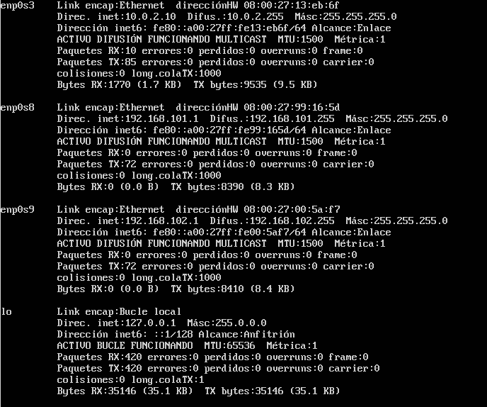
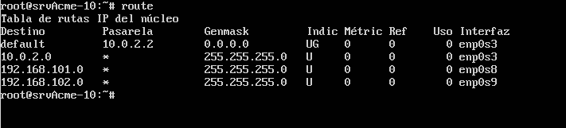
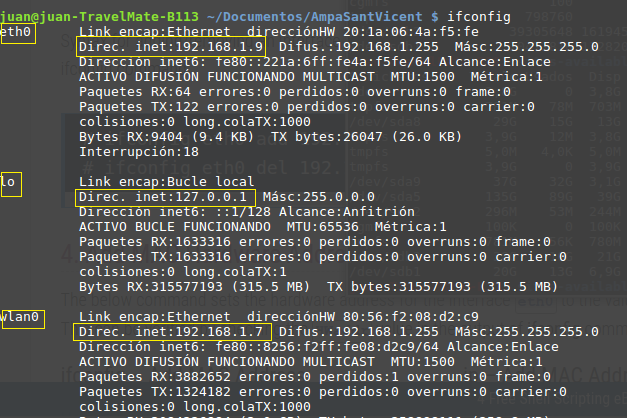
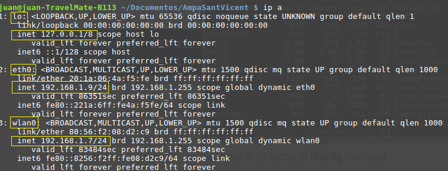
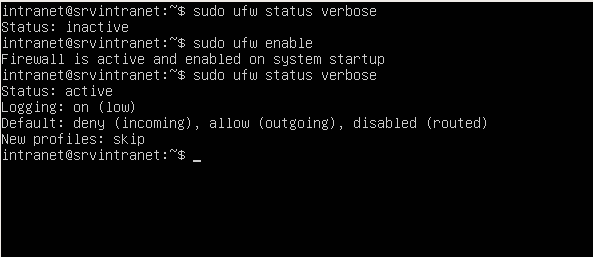

<!-- START doctoc generated TOC please keep comment here to allow auto update -->
<!-- DON'T EDIT THIS SECTION, INSTEAD RE-RUN doctoc TO UPDATE -->
**Table of Contents**  *generated with [DocToc](https://github.com/thlorenz/doctoc)*

- [Coses a tindre en compte amb Ubuntu 18.04](#coses-a-tindre-en-compte-amb-ubuntu-1804)
  - [Nom de les targetes](#nom-de-les-targetes)
  - [Xarxa en Ubuntu 18.04](#xarxa-en-ubuntu-1804)
    - [Fitxer de configuració](#fitxer-de-configuraci%C3%B3)
  - [Enrutament](#enrutament)
    - [Habilitar l'enrutament](#habilitar-lenrutament)
    - [Configurar NAT en sistemes netplan (Ubuntu 17.10 i posteriors)](#configurar-nat-en-sistemes-netplan-ubuntu-1710-i-posteriors)
    - [Configurar NAT des de Webmin](#configurar-nat-des-de-webmin)
    - [Configurar NAT amb `iptables`](#configurar-nat-amb-iptables)

<!-- END doctoc generated TOC please keep comment here to allow auto update -->

# Configurar la xarxa en GNU/Linux
Totes les distribucions GNU/Linux basades en Debian han configurat sempre la xarxa amb el paquet **ifupdown**. Aquest paquet permet configurar-la amb el fitxer `/etc/network/interfaces` encara que també es pot configurar des de l'entorn gràfic amb el **NetworkManager**.

A partir de Ubuntu 17.10 Canonical ha introduit una nova forma de configurar la xarxa: **netplan**. Ara el fitxer de configuració està dins de `/etc/netplan/` i es tracta d'un fitxer en format _YAML_ (on cada subsecció ha d'estar indentada de la secció pare amb uns ESPAIS en blanc). El motiu segons explique és per a superar certes limitacions de _ifupdown_.
La configuració gràfica continua igual amb el **NetworkManager**.

## Nom de les targetes
En GNU/Linux les targetes de xarxa s'identifiquen com ethX (eth0, eth1, ...) si són targetes ethernet cablejades o wlanX si són targetes WiFi (en ocasions es diuen athX si són wifis Atheros o amb altres noms depenent del fabricant).

El problema és que el nom que se li assigna depèn de quan es configura la targeta en arrancar (la primera serà la eth0, la segona la eth1) el que podria canviar entre un reinicie i un altre. A més algunes distribucions, com Ubuntu, assignen sempre el mateix nom d'interfície a cada MAC pel que si es desbarata una targeta i la canviem la nova ja no seria eth0 sinó el següent nom no usat. Açò també passa en màquines virtuals on podem canviar les MAC de les nostres targetes.

Moltes configuracions (firewall, etc) depenen del nom que tinguen les targetes pel que si aquest canvia deixaran de funcionar correctament. Per a evitar aquests problemes de no saber com es dirà cada interfície de xarxa, les últimes distribucions GNU/Linux s'utilitzen **Predictable Network Interface Names** que assigna identificadors estables a les interfícies de xarxa basant-se en el tipus (local Ethernet, WLAN, WWAN, etc).

Així les targetes que el kernel anomena com **ethX** són renombrades a **enoX** (si la targeta està integrada en la placa base) o **enpXsY** (per a targetes en slots PCI o altres) i aquests noms seran sempre els mateixos per a cada targeta. En màquines de VirtualBox la primera sol ser la **emp0s3**, la segona la **enp0s8**, ...

## Netplan vs ifupdown
Les principals diferències entre els dos sistemes són, entre uns altres:
* el fitxer de configuració que en _ifupdown_ era com tots de text pla (`/etc/network/interfícies`) ara és un fitxer _YAML_ que es troba dins de **`/etc/netplan`**
* el servei que gestiona la xarxa ara no és `networking` sino **`systemd-networkd`**
* per a activar o desactivar una interficie ja no tenim els comandos `ifup` i `ifdown` sinó:
```bash
    ip link set $targeta up
    ip link set $targeta down
```
* tampoc tenim el comando `ifconfig` que s'ha substituit per **`ip`**
* hi ha una nova comanda, networkctl, per a veure què dispositius tenim. Amb el paràmetre `status` ens dóna la configuració de cadascun:


Si li poem el nom d'una targeta ens dona la informació de la mateixa:


## Veure la configuració amb ifupdown
El comando per a veure la configuració de la xarxa és `ifconfig` (en Debian si no som root hem de posar la ruta sencera del comando `/sbin/ifconfig`):



Per a veure les rutes configurades i la porta d'enllaç tenim el comando `route`:



Ens indica que:
* tots els paquets amb destinació la xarxa 192.168.101.0/24 eixiran per la targeta enp0s8
* tots els paquets amb destinació la xarxa 192.168.102.0/24 eixiran per la targeta enp0s9
* tots els paquets amb destinació la xarxa 10.0.2.0/24 eixiran per la targeta enp0s3
* la resta de paquets aniran a la porta d'enllaç (10.0.2.2) per a targeta enp0s3

I per a veure el DNS mostrem el contingut del fitxer `/etc/resolv.conf`:


En aquest cas tenim com a DNS principal 127.0.0.1 (és a dir aquesta màquina) i com a secondari 8.8.8.8. No és convenient modificar ací els DNS perquè aquest fitxer és sobreescrit pels serveis que configuren la xarxa.

## Veure la configuració amb netplan
El comando `ifconfig` es troba en el paquet **net-tools** junt a `route` i altres. Netplan en compte d'aquest paquet inclou el paquet **iproute2util** que sustitueix aquest comando pel comando `ip` que és més potent. Per a veure la configuració escrivim:
```bash
ip addr show
```
(o simplement ip a). Podem veure només un resum d'aquesta informació amb `ip -br a`.




Per a veure la porta d'enllaç i les el comando és:
```bash
ip route show
```
(o simplement ip r)


## Accions més comuns
Tant els comandos `ifconfig` com `ip` ens permeten canviar al nostra configuració temporalment (per a canviar-la definitivament hem de fer-ho en els fitxers de configuració):
* desactivar una interfície de xarxa:
  * ifconfig: `ifconfig enp0s3 down`
  * ip: `ip link set enp0s3 down`
* volver-la a activar:
  * ifconfig: `ifconfig enp0s3 up`
  * ip: `ip link set enp0s3 up`
* afegir una nova IP a una interfície:
  * ifconfig: `ifconfig enp0s3 add 192.168.100.5/24`
  * ip: `ip addr add 192.168.100.5/24 dev enp0s3`
* eliminar-la IP:
  * ifconfig: `ifconfig enp0s3 del 192.168.100.5/24`
  * ip: `ip addr del 192.168.100.5/24 dev enp0s3`
* canviar la porta d'enllaç (per exemple que siga la 192.168.1.1):
  * ifconfig: `route add default gateway 192.168.1.1`
  * ip: `ip route add default via 192.168.1.1`

Podeu consultar més comandos en [aquesta pàgina](https://www.tecmint.com/ifconfig-vs-ip-command-comparing-network-configuration/).

## Enrutament
Una vegada les 2 targetes estiguen correctament configurades perquè els clients tinguen accés a Internet haurem de configurar el enrutamiento en el servidor, la qual cosa comporta 2 accions:
* habilitar l'enrutament
* configurar NAT

### Habilitar l'enrutament
L'enrutament el que fa és redirigir a la targeta de xarxa externa el tràfic de la targeta interna amb destinació a altres xarxes (com a Internet).

Si estem en Ubuntu 17.10 i posterior utilitzarem el Firewal **ufw** (uncomplicated Firewall). Per a habilitar l'enrutament editem el fitxer **/etc/ufw/sysctl.conf** i descomentem la línia:
```bash
net.ipv4.ip_forward=1
```
Per a recarregar el firewal el des-habilitem i el tornem a habilitar:
```bash
ufw disable
ufw enable
```
També podem activar eixa opció en la configuració del sistema en compte de en la del firewal descomentant la mateixa línia però del fitxer **/etc/ufw/sysctl.conf** (es el que hem de fer si tenim la versió 17.04 o anterior que no utilitza el firewall).

En aquest cas perquè faça efecte hem de recarregar la configuració amb:
```bash
sysctl -p
```

També podem habilitar-ho temporalment, fins que reiniciem la màquina, executant l'ordre
```bash
echo 1 > /proc/sys/net/ipv4/ip_forward
```
(si en comptes de echo 1 posem echo 0 ho deshabilitem).

Per a comprovar si està habilitat executem l'ordre
```bash
cat /proc/sys/net/ipv4/ip_forward
```
(si retorna 1 és que està habilitat).

### Configurar NAT en sistemes netplan (Ubuntu 17.10 i posteriors)
Amb netplan s'utilitza el Firewal **ufw**. Per defecte està desactivat i podem activar-ho o desactivar-ho amb els comandos ufw enable i ufw disable. Per a veure la configuració executem ufw status verbose:



Per a configurar NAT hem d'activar ufw i realitzar les següents accions:
1. Editar el fitxer **/etc/default/ufw** i canviar la línia `DEFAULT_FORWARD_POLICY="DROP"` per 
  ```bash
  DEFAULT_FORWARD_POLICY="ACCEPT"
  ```
2. Editar el titxer **/etc/ufw/before.rules** i afegir les següents línies al principi, abnans de les regles de filtrat (`*filter`)
```bash
# NAT table rules
*nat
:POSTROUTING ACCEPT [0:0]
-A POSTROUTING -s 192.168.100.0/24 -o enp0s3 -j MASQUERADE
COMMIT
```

Només queda reiniciar el Firewall (podem desactivar-ho i tornar-lo a activar). Per a comprovar les regles que estan aplicant-se executem el comando que ja hem vist:
```bash
iptables  -t nat -L
```
Si volem eliminar totes les regles que tenim ara en iptables (per a tornar-las a posar o per si ens hem equivocat):
```bash
iptables  -t nat -F
```
### Configurar NAT des de Webmin
Si fem la configuració de l'enrutament des de Webmin tot funciona igual però l'enrutament l'activa en **/etc/sysctl.conf** (no en /etc/ufw/sysctl.conf) i les regles de nat les guarda en **/etc/iptables.up.rules** (en compte de en /etc/ufw/before.rules) i les carrega afegint la següent línia a **/etc/network/interfaces**:
```bash
post-up iptables restore < /etc/iptables.up.rules
```

### Configurar NAT amb `iptables`
Si volem podem afegir una regla a iptables igual que es feia en les versions anterios. Per exemple si la nostra targeta externa és la eth0 amb IP 10.0.2.20 i la nostra xarxa interna és la 192.168.10.0 el comando per a activar NAT seria:
```bash
iptables -t nat -A POSTROUTING -s 192.168.10.0/24 -o enp0s3 -j SNAT --to 10.0.2.20
```

El que indiquem és d'on provindrà el tràfic a enrutar (`-s xarxa interna/màscara`, és a dir, `-s 192.168.10.0/24`) a quina targeta s'enviarà (-o targeta externa, és a dir, `-o enp0s3`) i quin és la IP d'aquesta targeta externa (`-j SNAT --to 10.0.2.20`). Si nostra IP externa pot canviar (perquè és dinàmica) el que posarem és `-j MASQUERADE`.

Per a evitar haver d'executar aquest comando cada vegada que reiniciem el sistema instal·larem el paquet **iptables-persistent** que ens pregunta si emmagatzema la configuració actual de iptables (v4 i v6) i la càrrega de nou cada vegada que reiniciem el sistema. Si posteriorment fem modificacions en les iptables per a que ens torne a preguntar si guarda els canvis farem
```bash
dpkg-reconfigure iptables-persistent
```

Per a comprovar si el nostre sistema està fent NAT executem l'ordre:
```bash
iptables -t nat - L
```

