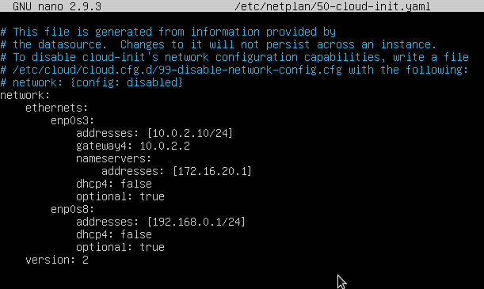

# Coses a tindre en compte amb Ubuntu 18.04

##  Xarxa en Ubuntu 18.04
Des de la versió 18.04 Server Ubuntu ha abandonat el sistema de configuració de la xarxa **ifupdown** i lo ha canviat per **netplan**.

Els canvis que açò comporta són, entre uns altres:
* el fitxer de configuració és un fitxer _YAML_ que hi ha dins de **/etc/netplan** (abans era /etc/network/interfícies)
* el servei ara és **systemd-networkd** (abans networking). Per a reiniciar-ho fem `systemctl restart systemd-networkd`
* per a activar o desactivar una interficie ja no existeixen **ifup** i **ifdown** sinó:
```bash
    ip link set $targeta up
    ip link set $targeta down
```
* hi ha una nova comanda, networkctl, per a veure què dispositius tenim. Amb el paràmetre status ens dóna la configuració de cadascun

### Fitxer de configuració
Es tracta d'un fitxer YAML. Açò significa que cada opció va en una línia i si una està dins de l'anterior ha d'anar indentada cap a dins 4 espais (ULL han de ser 4 i no serveix tabulador).

Exemple de fitxer d'una màquina amb una única targeta configurada per DHCP:
```bash
network:
    version: 2
    ethernets:
        enp0s3:
            dhcp4: yes
```
Si volem configurar una altra targeta i que siguen ambdues estàtiques:
```bash
network:
    version: 2
    ethernets:
        enp0s3:
            addresses: [10.0.2.10/24]
            gateway: 10.0.2.2
            nameservers:
                addresses: [172.16.20.1]
            dhcp4: false
            optional: true
        enp0s8:
            addresses: [192.168.0.1/24]
            dhcp4: false
            optional: true
```


**ATENCIÓ**: ha d'haver-hi un espai entre els : i el valor de l'opció i no pot haver-hi espais al final d'una línia.

Perquè s'apliquen els canvis no és necessari reiniciar el servei de xarxa sinó que n'hi ha prou amb fer:
```bash
netplan apply
```

En el cas de la versió Desktop segueix sent **NetworkManager** qui s'encarrega de configurar la xarxa, la qual cosa s'indica en el fitxer que hi ha en _/etc/netplan_:


## Enrutament
Una vegada les 2 targetes estiguen correctament configurades perquè els clients tinguen accés a Internet haurem de configurar el enrutamiento en el servidor, la qual cosa comporta 2 accions:
* habilitar l'enrutament
* configurar NAT

L'enrutament el que fa és redirigir a la targeta de xarxa externa el tràfic de la targeta interna amb destinació a altres xarxes (com a Internet).

Per a habilitar l'enrutament editem el fitxer /etc/sysctl.conf i descomentem la línia:
```bash
net.ipv4.ip_forward=1
```

Perquè faça efecte hem de recarregar la configuració amb:
```bash
sysctl -p
```

També podem habilitar-ho temporalment, fins que reiniciem la màquina, executant l'ordre
```bash
echo 1 > /proc/sys/net/ipv4/ip_forward
```
(si en comptes de echo 1 posem echo 0 ho deshabilitem).

Per a comprovar si està habilitat executem l'ordre
```bash
cat /proc/sys/net/ipv4/ip_forward
```
(si retorna 1 és que està habilitat).

Respecte al NAT hem d'afegir una regla a iptables. Per exemple si la nostra targeta externa és la eth0 amb IP 10.0.2.20 i la nostra xarxa interna és la 192.168.10.0 el comando per a activar NAT seria:
```bash
iptables -t nat -A POSTROUTING -s 192.168.10.0/24 -o enp0s3 -j SNAT --to 10.0.2.20
```

El que indiquem és d'on provindrà el tràfic a enrutar (`-s xarxa interna/màscara`, és a dir, `-s 192.168.10.0/24`) a quina targeta s'enviarà (-o targeta externa, és a dir, `-o enp0s3`) i quin és la IP d'aquesta targeta externa (`-j SNAT --to 10.0.2.20`). Si nostra IP externa pot canviar (perquè és dinàmica) el que posarem és `-j MASQUERADE`.

Per a evitar haver d'executar aquest comando cada vegada que reiniciem el sistema instal·larem el paquet **iptables-persistent** que ens pregunta si emmagatzema la configuració actual de iptables (v4 i v6) i la càrrega de nou cada vegada que reiniciem el sistema. Si posteriorment fem modificacions en les iptables per a que ens torne a preguntar si guarda els canvis farem
```bash
dpkg-reconfigure iptables-persistent
```

Per a comprovar si el nostre sistema està fent NAT executem l'ordre:
```bash
iptables -t nat - L
```

