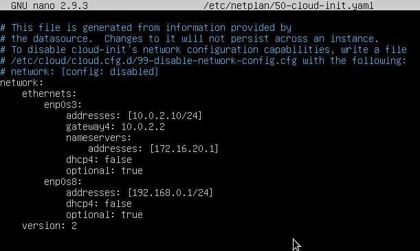
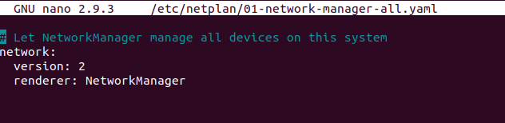

## Configurar la xarxa
Tots els canvis que fem amb el comando `ifconfig` o ip són temporals i es perden quan reiniciem la xarxa. El servei de xarxa, denominat networking, quan s'inicia configura la xarxa amb el contingut del fitxer /etc/network/interfaces. Per tant, per a canviar la configuració permanentment hem de canviar-la en aquest fitxer.

### Configuració de la xarxa amb ifupdown

Configurar la red

La informació que trobem és:

auto: perquè la interfície s'active automàticament en arrancar l'equip sense haver de fer ifup.
allow-hotplug: perquè la interfície s'active automàticament en detectar un esdeveniment en la interfície (com que es connecta el cable).
inet dhcp: per a configurar aquesta interfície per DHCP
inet static: per a configurar-la estàticament. Haurem d'indicar els seus paràmetres:
address: l'adreça IP
netmask: la màscara de xarxa
gateway: la porta d'enllaç
dns-nameservers: servidors DNS (separats per espai)
Un altre exemple amb 2 targetes de xarxa configurades estàticament:

Configurar la red

Podem configurar cada interfície de forma estàtica (iface ethX inet static) o per dhcp (iface ethX inet dhcp). Si ho fem estàticament hem d'indicar la IP (address), la màscara (netmask), la porta d'enllaç si fa falta (gateway) i els servidors DNS (dns-nameservers). També es pot indicar la xarxa (network) i l'adreça de broadcast però no és necessari perquè es pot calcular a partir de la IP i la màscara.

Després de modificar el fitxer de configuració hem de reiniciar el servei de xarxa (amb systemd):

systemctl restart networking
o (amb el sistema d'inici SysV)


service networking restart
o directament:

/etc/init.d/networking restart


En ocasions cal reiniciar la targeta que hem canviat amb ifdown ethX i ifup ethX.

Els servidors DNS es poden configurar també en el fitxer /etc/resolv.conf encara que se sobreescriu el seu contingut amb el qual indiquem en /etc/network/interfícies en l'apartat dns-nameservers en reiniciar el servei de xarxa pel que s'ha de configurar allí. Un exemple de fitxer és:

Configurar la red

A més en el fitxer /etc/hosts podem posar els noms que el nostre propi ordinador ha de resoldre:

Configurar la red

Si la nostra màquina té una IP fixa hauríem d'afegir-la ací també al costat del nom del host.

Respecte a la xarxa física, si treballem amb una màquina virtual la targeta interna la configurarem en VirtualBox com a 'Xarxa interna' i li assignarem un nom (és com si fóra el nom del switch al que es connecta el seu cable). Per a la interfície externa Virtualbox ens ofereix 2 opcions:

Adaptador pont: la màquina serà una més de la xarxa real i es podrà accedir a ella des de qualsevol equip de la xarxa. Per tant la seua IP ha de ser una IP de la xarxa. El problema és que la xarxa en l'aula i a casa són diferents per la qual cosa la configuració que funciona a casa no ho fa en l'aula.
NAT: en aquest cas formen part d'una xarxa virtual que crea VirtualBox en la qual només estem nosaltres i el gateway que ens dóna eixida a l'exterior (amb la IP 10.0.2.2). L'avantatge és que aquesta configuració funciona en qualsevol lloc (perquè el 10.0.2.2 ens dóna eixida a l'ordinador real que ens trau en Internet) però des de fora d'aqueixa xarxa no es pot accedir a la nostra màquina (fins i tot no es pot accedir des de la màquina amfitrió).
Si la xarxa no funciona podem veure els missatges d'inici relacionats amb la xarxa amb:

dmesg | grep eth
o si el nom de les nostrres targetes és enpXsY

dmesg | grep enp


### Fitxer de configuració
Es tracta d'un fitxer YAML. Açò significa que cada opció va en una línia i si una està dins de l'anterior ha d'anar indentada cap a dins 4 espais (ULL han de ser 4 i no serveix tabulador).

Exemple de fitxer d'una màquina amb una única targeta configurada per DHCP:
```bash
network:
    version: 2
    ethernets:
        enp0s3:
            dhcp4: yes
```
Si volem configurar una altra targeta i que siguen ambdues estàtiques:
```bash
network:
    version: 2
    ethernets:
        enp0s3:
            addresses: [10.0.2.10/24]
            gateway4: 10.0.2.2
            nameservers:
                addresses: [172.16.20.1]
            dhcp4: false
            optional: true
        enp0s8:
            addresses: [192.168.0.1/24]
            dhcp4: false
            optional: true
```


**ATENCIÓ**: ha d'haver-hi un espai entre els : i el valor de l'opció i no pot haver-hi espais al final d'una línia.

Perquè s'apliquen els canvis no és necessari reiniciar el servei de xarxa sinó que n'hi ha prou amb fer:
```bash
netplan apply
```

En el cas de la versió Desktop segueix sent **NetworkManager** qui s'encarrega de configurar la xarxa, la qual cosa s'indica en el fitxer que hi ha en _/etc/netplan_:


